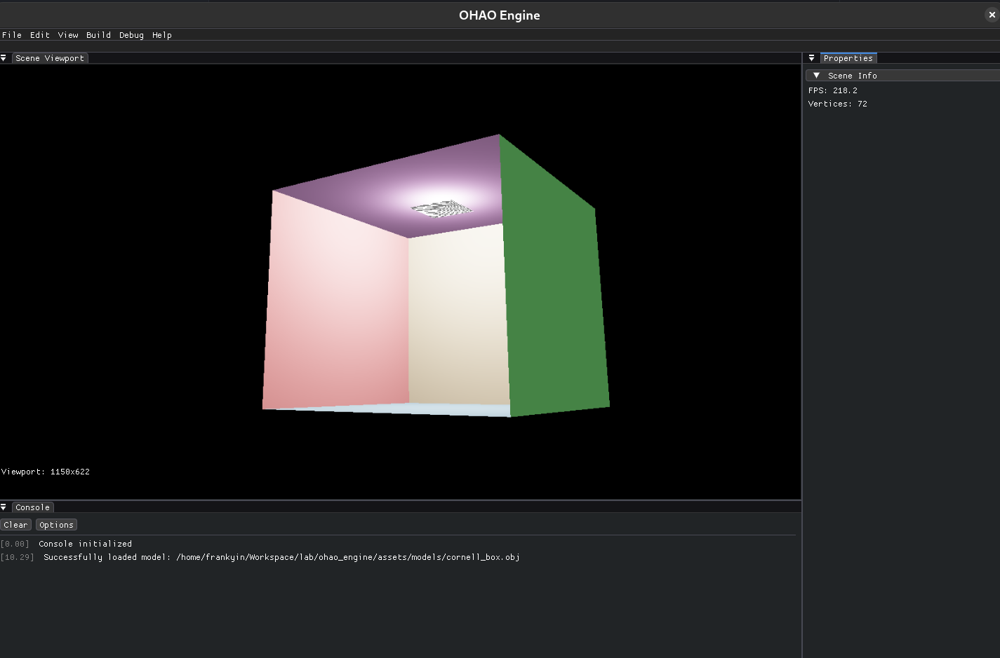
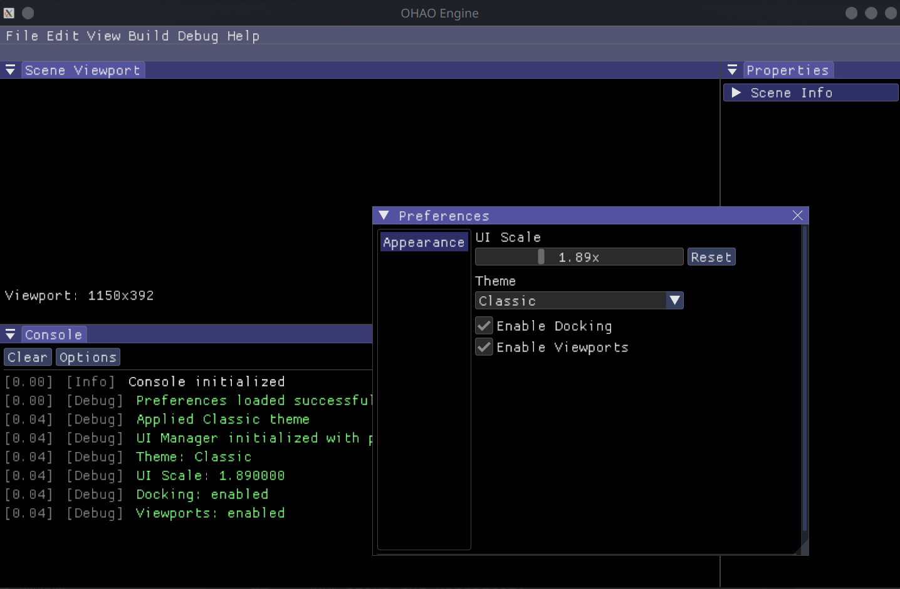

# OHAO Engine

OHAO Engine is a custom physics and rendering engine that integrates with Godot 4.x as a GDExtension. It features a Vulkan-based renderer and custom physics simulation.

<div style="display: flex;">
  <div style="flex: 1;">
    
  </div>
  <div style="flex: 1;">
    
  </div>
</div>

## Architecture

OHAO Engine runs as a GDExtension plugin inside Godot Editor, providing:
- Custom Vulkan offscreen renderer (renders to texture displayed in Godot)
- Custom physics simulation
- Actor-component system for scene management

```
Godot Editor
    │
    ▼
OhaoViewport (GDExtension)
    │
    ├─ OffscreenRenderer (Vulkan)
    │     └─ Renders scene to pixel buffer
    │
    └─ Scene/Actor/Component system
          └─ Custom physics simulation
```

## Building

### Prerequisites

**macOS:**
- Xcode Command Line Tools
- CMake 3.20+
- Vulkan SDK (via MoltenVK from Homebrew)
- SCons (for GDExtension)
- Godot 4.x

```bash
# Install dependencies on macOS
xcode-select --install
brew install cmake vulkan-loader molten-vk scons
```

**Linux:**
- CMake 3.20+
- Vulkan SDK
- SCons
- Godot 4.x

```bash
# Install dependencies on Ubuntu/Debian
sudo apt install cmake libvulkan-dev scons
```

### Clone the Repository

```bash
git clone --recursive https://github.com/Qervas/ohao-engine.git
cd ohao-engine

# Or if you already cloned without --recursive:
git submodule update --init --recursive
```

### Build Steps

#### 1. Build Engine Libraries

```bash
mkdir -p build && cd build
cmake ..
make -j$(nproc)  # Linux
make -j8         # macOS
```

#### 2. Build GDExtension

```bash
cd godot_editor
scons platform=macos arch=arm64    # macOS Apple Silicon
scons platform=macos arch=x86_64   # macOS Intel
scons platform=linux arch=x86_64   # Linux
```

#### 3. Run in Godot Editor

```bash
cd godot_editor/project
godot -e
```

The OHAO Viewport tab will appear in the Godot Editor, displaying the custom Vulkan renderer output.

### Controls (in OHAO Viewport)

- **Arrow Keys**: Orbit camera (pitch/yaw)
- **W/S**: Zoom in/out
- **A/D**: Pan left/right
- **Q/E**: Pan up/down

## Project Structure

```
ohao-engine/
├── src/
│   ├── engine/          # Actor-component system, scene management
│   │   ├── actor/       # Entity system
│   │   ├── asset/       # Asset loading
│   │   ├── component/   # Mesh, Transform, Light, Physics components
│   │   └── scene/       # Scene management & loaders
│   ├── physics/         # Custom physics engine
│   │   ├── collision/   # Broad/narrow phase collision
│   │   ├── dynamics/    # Rigid body dynamics
│   │   ├── constraints/ # Physics constraints
│   │   └── world/       # Physics world management
│   ├── renderer/        # Vulkan rendering
│   │   ├── offscreen/   # Headless Vulkan renderer
│   │   ├── camera/      # Camera system
│   │   └── material/    # Material system
│   └── ui/              # Logging utilities
├── godot_editor/        # GDExtension for Godot 4.x
│   ├── src/             # GDExtension source (OhaoViewport, etc.)
│   ├── godot-cpp/       # Godot C++ bindings (submodule)
│   └── project/         # Godot project with OHAO plugin
├── shaders/             # GLSL shaders (compiled to SPIR-V)
└── external/            # External dependencies
```

## Development Status

- [x] Vulkan offscreen rendering
- [x] GDExtension integration with Godot 4.x
- [x] Actor-component system
- [x] Custom physics simulation
- [x] Camera controls in viewport
- [x] Full PBR material rendering (Cook-Torrance GGX BRDF)
- [x] Scene synchronization from Godot
- [x] Shadow mapping (PCF soft shadows)
- [x] Multi-frame rendering (3 frames in flight)
- [ ] Cascaded Shadow Maps (CSM)
- [ ] Deferred rendering pipeline
- [ ] Image-Based Lighting (IBL)

## Documentation

- [Architecture Overview](docs/architecture/README.md) - System design, diagrams, rendering pipeline
- [Bug Fixes History](docs/bugs_solved/README.md) - Solved issues and their solutions
- [Changelog](CHANGELOG.md)

## License

[MIT License](LICENSE)

## Author

[Qervas](mailto:djmax96945147@outlook.com)

## Acknowledgments

- [Godot Engine](https://godotengine.org/) - Game engine and editor
- [Vulkan](https://www.vulkan.org/) - Graphics API
- [MoltenVK](https://github.com/KhronosGroup/MoltenVK) - Vulkan on macOS
