# OHAO Engine

A solo **Vulkan 1.3** hybrid renderer in **C++20**: KHR path tracing for ground truth and indirect light, deferred raster for real-time, shared scene / materials / TLAS. No editor host.

<p align="center">
  <!-- GitHub README strips <video>; animated GIF autoplays inline. Click opens the full MP4 on GitHub's video player. -->
  <a href="https://github.com/Qervas/ohao_engine/blob/master/docs/media/helmet_orbit.mp4">
    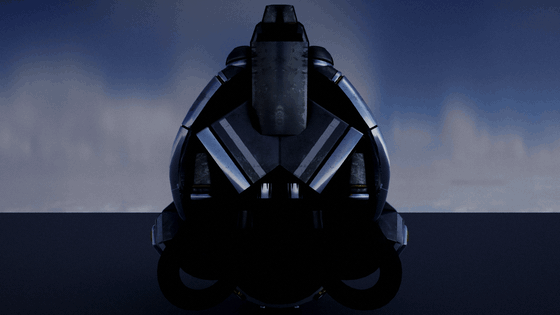
  </a>
</p>

<p align="center">
  <a href="https://github.com/Qervas/ohao_engine/blob/master/docs/media/helmet_orbit.mp4">
    <strong>▶ Play full-quality orbit (MP4)</strong>
  </a>
  &nbsp;·&nbsp;
  <sub><em>Real-time path tracing ~67 fps — DLSS Ray Reconstruction · ReSTIR GI · cinematic grade. GIF loops above; the button opens the repo MP4 in GitHub’s player.</em></sub>
</p>

## What it is

Built to learn how a modern hybrid renderer is wired end to end. ~52K lines of **C++20** and ~14K lines of GLSL across 121 shaders, with two pipelines that share scene, materials, and acceleration structures. No engine SDK, no editor host. Path tracer is for ground truth. Deferred is for interactive iteration. The hybrid mode runs RT shadows and 1-bounce RT GI on top of the deferred G-buffer.

**Recent focus:** multi-pipeline **inverse rendering lab** (path-tracer oracle + Diff-IR Deferred sibling) on one Vulkan host — capture-gated holdout/relight bars, modular C++20.

## Inverse lab — recover materials from pixels

Multi-pipeline inverse rendering on one Vulkan host: **path-tracer oracle** (capture-gated LABTEST) + **Diff-IR Deferred** sibling (free dense maps as beauty SoT). Fit is train-only; published dB always name the **metric domain**. Full tables + machine-readable pack: [`docs/media/inverse/RESULTS.md`](docs/media/inverse/RESULTS.md).

> **What these numbers are — and aren't.** The dB below are **synthetic self-consistency**: the targets are the engine's *own renders* of a known material θ (LABTEST, `metric_gt=capture_export_images`), so a good fit is expected and does **not** by itself prove inverse rendering on real data. Gradients are **finite-difference**, not autodiff — the "Diff-IR" backend carries one analytic albedo gradient (linear `I≈A⊙S`, lighting detached) and finite-differences everything else. Recovering materials from **real photographs the engine never rendered** ([roadmap H3](docs/inverse_lab_roadmap.md)) is the honest acid test — it is **in progress**, and that is where a real claim will come from.

### Publish face — Diff-IR quality plate (1080p SHOW)

Hard presets only (spheres · helmet · outdoor). Free dense **roughness** (ORM.g), map ≥128², multi-view, wrong-init → recovered → GT. **Not** the 256×144 lab_fast toy.

<p align="center">
  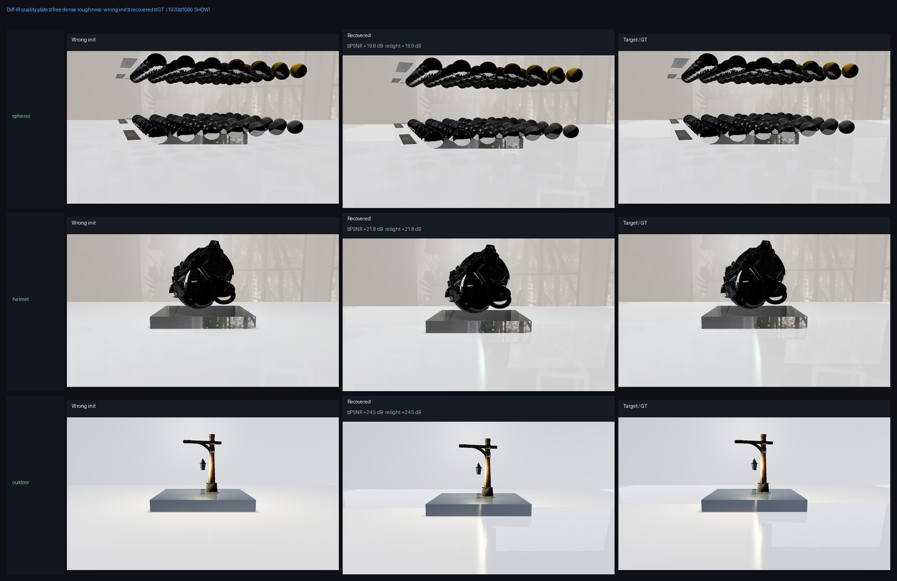
</p>

| Preset | Init → train PSNR | ΔPSNR | Rough map MSE | Relight Δ | Domain |
|--------|-------------------|-------|---------------|-----------|--------|
| spheres | 38.3 → 58.1 | **+19.8 dB** | 0.362 → 0.179 | +19.9 dB | Deferred dense ORM · 1920×1080 |
| helmet | 35.8 → 57.6 | **+21.8 dB** | 0.362 → 0.081 | +21.8 dB | same |
| outdoor | 32.4 → 56.9 | **+24.5 dB** | 0.362 → 0.194 | +24.5 dB | same |

<p align="center">
  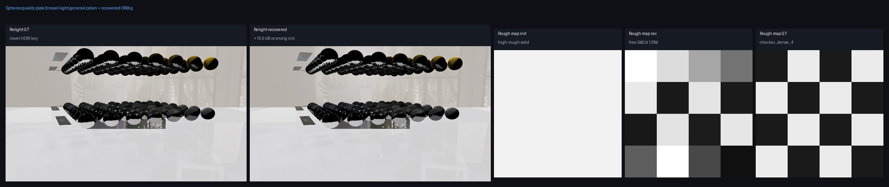
</p>

<sub>Novel-HDRI relight on spheres (+19.9 dB vs wrong init) and free-grid roughness maps (init → recovered → GT).</sub>

### PT capture-gated LABTEST (oracle plate)

Wrong init → recovered → **capture export** GT (not live-oracle theater). Holdout / relight gates on exported PNGs.

<p align="center">
  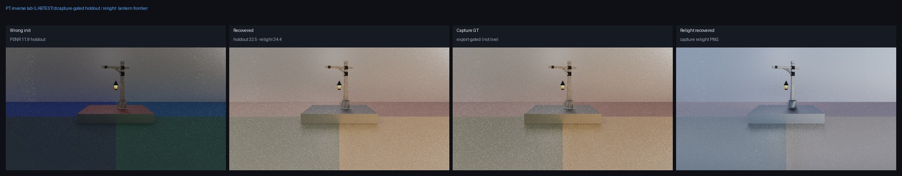
</p>

| Gate | Target | Measured |
|------|--------|----------|
| Holdout PSNR / SSIM | ≥ 28 dB | **32.5 dB** / 0.983 |
| Relight PSNR / SSIM | ≥ 26 dB | **34.4 dB** / 0.989 |
| Holdout gain vs wrong init | ≥ 8 dB | **+20.5 dB** |
| Train RMSE before → after | — | **0.299 → 0.0195 (−93.5%)** |
| Metric domain | — | `capture_export_images` |

### Museum publish face — NIUA amphora · 1080p SHOW

Dark museum product shell with a **clear amphora** hero (not lantern / sphere chart). Free dense **marble floor** maps: wrong-init cool solid → recovered checker → GT. Optim at draft FIT; **publish stills at 1920×1080**. Domain `ohao_museum_studio_protocol` — not a public IR bench claim.

<p align="center">
  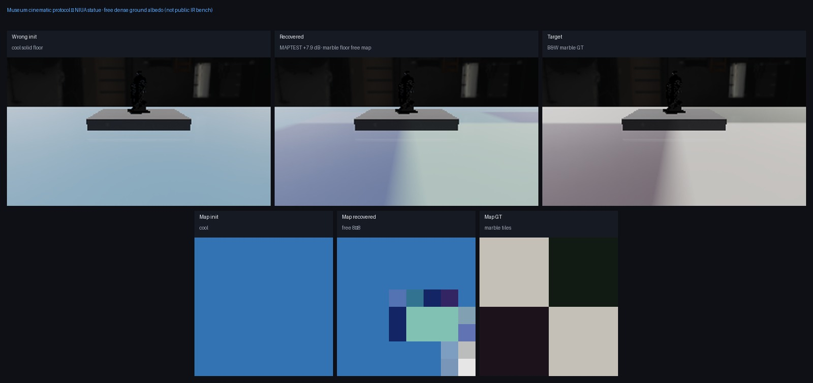
</p>

| Gate | Measured |
|------|----------|
| SHOW stills | **1920×1080** wrong / recovered / GT |
| MAPTEST ΔPSNR | **+21.5 dB** (16.9 → 38.3) |
| Map MSE | 0.232 → **0.0019** |
| Hero | NIUA `amphora.glb` · free θ = ground albedo only |
| Domain | `ohao_museum_studio_protocol` |

```bash
./build/inverse_fit --backend diff --preset museum --dense-map --dense-map-res 128 \
  --quality draft --out-dir renders/diff_museum_plate --no-visual-polish
python3 tools/inverse_lab/test_dense_map.py renders/diff_museum_plate
python3 tools/inverse_lab/make_readme_figures.py
```

### Diff-IR dense maps (albedo · metal) + analytic speed

Beauty θ is a **bindless Deferred-sampled map** (albedo / ORM). Wrong-init is cool solid / low-metal / high-rough — never free-gift GT warm start. Map MSE is first-class beside PSNR.

<p align="center">
  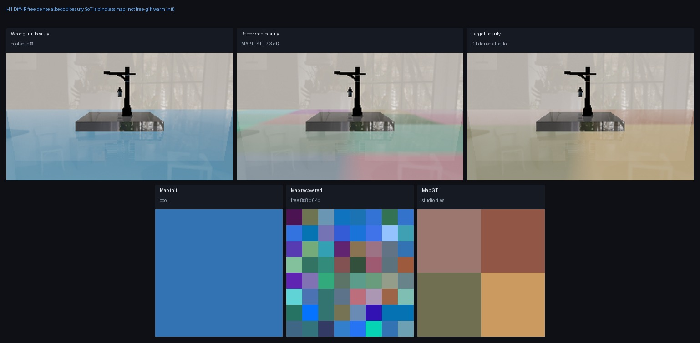
</p>
<p align="center">
  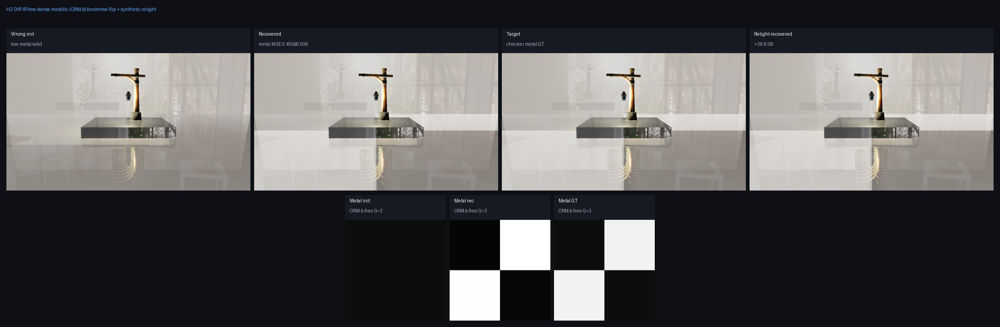
</p>

| Task | ΔPSNR (train) | Map MSE | Key×2.5 Δ | Notes |
|------|---------------|---------|-----------|--------|
| Dense albedo 64² free-grid | +7.3 dB | 0.104 → 0.084 | — | MAPTEST; cool wrong-init |
| Dense albedo 128² | +7.2 dB | 0.104 → 0.080 | — | same protocol |
| Dense metallic ORM.b | **+28.1 dB** | 0.405 → **0.0016** | +28.0 dB | extreme flip; FIT 640×360 |
| Dense roughness ORM.g (lab) | +5.5 dB | 0.378 → 0.250 | +3.4 dB | floor-crop specular loss; FIT 640×360 |

> **Corrected 2026-07-25.** The "Relight Δ" column previously read +26.9 / +22.1 dB. Those numbers were
> not a relight at all: the dense fits boosted the key light and then called a forward with
> `force=true`, whose first statement (`inv.applyTruth()`) drove the key intensity straight back to the
> training value — so both "relit" renders were the *training* render. The relight PNGs were
> byte-identical to the training PNGs (verified: mean-abs-diff exactly 0.000000). The column is now a
> genuine **2.5× scale of the same key light** — it is *not* novel illumination (no environment swap,
> no light moved, no light added), and the dense paths do not fit lights at all. For capture-exported
> novel-lighting relight see the PT LABTEST row above. The train/map numbers also moved because the
> previously published values came from stale `renders/` metrics files predating commit `3557cfb`,
> which changed both dense fits; every number in this table row is now from the exact command in
> [`docs/inverse_lab.md`](docs/inverse_lab.md) on current `HEAD`.

**H4 analytic albedo** (linear solve + residual + sparse polish; GRADCHECK vs FD — **not** a reverse-mode autodiff claim):

| Metric | Value |
|--------|-------|
| GRADCHECK median rel err vs coord FD | 0.198 (gate &lt; 0.20) |
| Analytic optim wall-clock | 2.2 s |
| Est. full 3-pass coord FD | 42.8 s |
| **Speedup** | **19.7×** |
| MAPTEST after analytic path | +2.8 dB · map MSE drop |

<p align="center">
  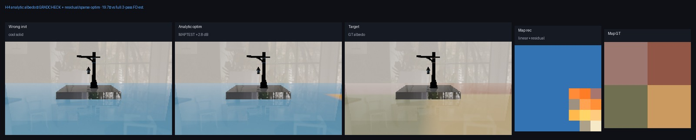
</p>

### Photo proxy (domain shift) — PHOTOTEST

Domain-shifted multi-view capture. Gates are **gain vs wrong-init**, not synthetic ≥28 absolute theater under photo noise.

<p align="center">
  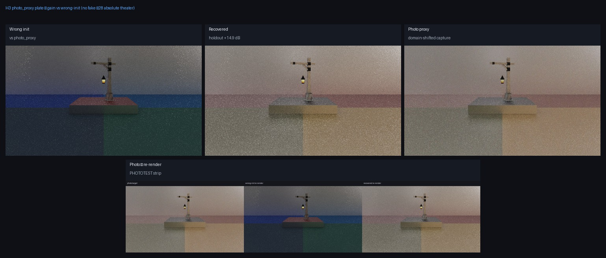
</p>

| Metric | Value | Domain |
|--------|-------|--------|
| Holdout gain vs wrong init | **+14.9 dB** | `photo_proxy_images` |
| Holdout / relight PSNR | 28.7 / 27.4 dB | capture-exported |
| PHOTOTEST | PASS (gain ≥ 3 dB) | no fake LABTEST bar |

### Reproduce

```bash
# Publish-face quality plate (1080p hard presets)
./scripts/run_inverse_quality_plate.sh

# PT capture-gated frontier
./build/inverse_fit --backend pt \
  --lab-bundle renders/inverse_lab/lantern_frontier/capture \
  --quality draft --out-dir renders/inverse_lab/lantern_frontier_fit

# Dense albedo + analytic ≥10× path
./build/inverse_fit --backend diff --dense-map --dense-map-res 64 --dense-grid 8 \
  --fit-width 256 --fit-height 144 --preset lantern --out-dir renders/diff_dense_analytic
python3 tools/inverse_lab/test_dense_analytic.py renders/diff_dense_analytic

# Rebuild README figures + RESULTS pack from existing renders/
python3 tools/inverse_lab/make_readme_figures.py
```

Docs: [`docs/inverse_lab.md`](docs/inverse_lab.md) · [`docs/inverse_lab_roadmap.md`](docs/inverse_lab_roadmap.md) · [`docs/media/inverse/RESULTS.md`](docs/media/inverse/RESULTS.md) · [`docs/inverse_photo_lab.md`](docs/inverse_photo_lab.md) · deck: [`docs/media/inverse/OHAO_Inverse_Lab_Showcase.pptx`](docs/media/inverse/OHAO_Inverse_Lab_Showcase.pptx)

## Headline numbers

| Metric | Value |
|---|---|
| Language | **C++20** |
| C++ source | ~52K LOC across `ohao/` |
| GLSL shaders | ~14K LOC across 121 files |
| Render code | ~24K LOC |
| GPU/Vulkan layer | ~9K LOC |
| Physics (Jolt) | ~11K LOC |
| Scene graph | ~7K LOC |
| Denoise backends | 4 (Intel OIDN, NVIDIA OptiX, NVIDIA NRD, NVIDIA DLSS-RR) |

## Real-time path tracing — and the firefly that taught me the most

The most recent stretch pushed the interactive viewer from noisy preview to real-time path tracing at 67 fps (1 spp, 720p), denoised with NVIDIA DLSS Ray Reconstruction and stabilized with ReSTIR GI. The fix I got the most out of, though, was the smallest one.

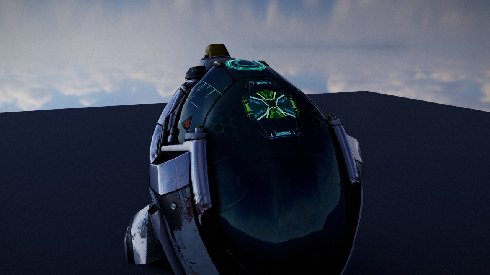

### The 1-spp firefly storm — importance sampling + MIS

**Symptom.** At one sample per pixel, metal and ground sparkled: bright pixels flashing at random every frame. Denoising couldn't touch it — the denoiser was being fed garbage.

**Cause.** The real-time integrator reached the bright HDRI environment *only* through random BSDF bounces. A rare ray that happened to land on the sun returned `radiance / (tiny pdf)` — a colossal spike. That's unbounded Monte-Carlo variance, by construction. The offline path already importance-sampled the environment; the real-time fork I'd split off didn't.

**Fix.** Importance-sample the environment by its own luminance (marginal + conditional CDF), shadow-trace, and MIS-weight against BSDF sampling with the balance heuristic:

```glsl
// shaders/rt/pt_raygen_realtime.rgen
sampleEnvMap(u1, u2, ..., out envDir, out envPdf);   // sample the sky where it's bright
if (dot(N, envDir) > 0.0 && envPdf > 0.0) {
    traceRayEXT(...);                                 // visibility toward the sampled dir
    if (payload.hitDist < 0.0) {                      // ray escaped -> it saw the env
        float w = misBalanceHeuristic(envPdf, bsdfPdfAtEnv);
        radiance += envRadiance * (diff + spec) * NdotL * w / envPdf;   // /envPdf cancels the spike
    }
}
```

**Lesson.** Variance isn't noise you denoise away — it's a sampling problem you solve at the source. A denoiser can only reconstruct a signal whose variance is already low. Every later win was the same move: cut variance *before* the denoiser, not after.

### The flicker that wasn't where it looked

Chrome on a test helmet flickered frame to frame. I built two plausible fixes — feeding DLSS the specular hit-distance guide, then swapping the glossy sampler for GGX VNDF importance sampling (Heitz 2018) — measured both with a drift-controlled A/B, and both came back *not* fixing it. The control gave it away: a diffuse wall that should read a temporal std of ~3 measured ~27. The ReSTIR-GI reservoir was still boiling, and the metal was just reflecting it — and a reflection is view-dependent, so the denoiser can't reproject the boil away the way it does on the walls.

| scene | metal flicker (temporal std) | fps (1 spp) |
|---|---|---|
| enclosed room | ~15 | ~35 |
| open HDRI scene | **0.69** | **67** |

The fix was the scene, not the sampler: an open environment reflects a stable sky instead of boiling GI, and one importance-sampled HDRI replaces four noisy area lights — ~20× less flicker and ~2× faster. Same lesson: ask *what* the pixel reflects before *how* the ray is aimed.

<p>
  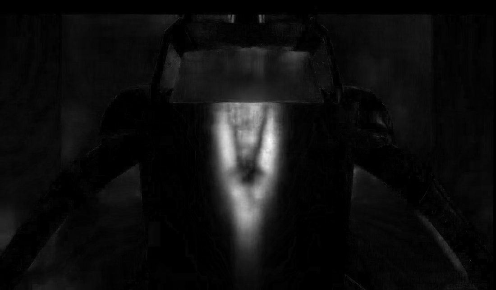
  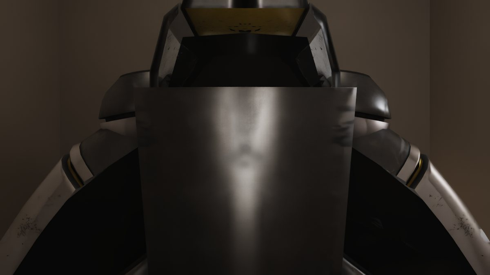
</p>

*Left: a per-pixel temporal-standard-deviation map — bright = flickering. The metal glows; the diffuse walls are black, which is what pointed at the reflection. Right: the enclosed room the flicker came from.*

I also tried **ReSTIR DI** for the direct lighting and reverted it — the weight calculation introduced more noise than it removed. Measuring that honestly and backing it out was the right call; ReSTIR GI on the indirect bounce stayed, and does the real variance reduction (3.2× less boil, unbiased).

## Architecture

Two pipelines, one scene. Both consume the same bindless texture array, the same material SSBO, the same TLAS. Switch at runtime via `--denoise=` and the example app argv.

```
                         scene + materials + lights
                                    |
                  +-----------------+-----------------+
                  |                                   |
            Path Tracer (rt/)                Deferred (deferred/)
            VK_KHR_ray_tracing_pipeline      G-buffer + lighting
            NEE + MIS + env-map IS           CSM, SSAO, SSR, SSS
            Sobol + Owen scramble            TAA, bloom, ACES
            OIDN / OptiX / NRD denoise       (RT shadow + RT GI plug in here)
                  |                                   |
                  +----------------+------------------+
                                   |
                            output (PNG / swapchain)
```

### Path tracing

Lives in `ohao/render/rt/`. Vulkan KHR ray tracing pipeline. Files are split: `path_tracer.cpp` for the orchestrator, `path_tracer_descriptors.cpp` for the 30-binding descriptor layout, `path_tracer_images.cpp` for the AOV images, `path_tracer_pipeline.cpp` for the SBT, `path_tracer_render.cpp` for dispatch.

- Next-event estimation with multi-light sampling from a GPU light SSBO
- MIS with both balance heuristic and power heuristic (beta=2), see `shaders/includes/rt/mis.glsl`
- Environment map importance sampling: marginal + conditional CDF binary search in `shaders/includes/rt/env_sampling.glsl`, CDFs built CPU-side in `env_cdf.cpp`
- Sobol QMC sequence with Owen scrambling (`owen_scramble.cpp`, `sobol_generator.cpp`)
- Adaptive sampling: per-pixel variance estimated from a 3x3 neighborhood in `pt_raygen.rgen`, sample budget steered by noise level
- Cook-Torrance GGX BRDF, bindless PBR textures (diffuse, normal, rough/metal, emissive)
- Alpha transparency via any-hit shader for foliage and hair cards
- Animated geometry: `animated_rt_manager.cpp` does GPU skinning into a vertex buffer that feeds BLAS rebuilds

### Denoising (three backends, runtime switchable)

| Backend | Files | Use |
|---|---|---|
| Intel OIDN 2.x | `oidn_denoise.cpp/.hpp` | CPU post-process for offline reference |
| NVIDIA OptiX 9.1 | `optix_denoise.cpp/.hpp` | GPU denoise via CUDA interop, optional |
| NVIDIA NRD 4.17 | `nrd_denoise.cpp`, `nrd_compose.cpp`, `nrd_tonemap.cpp` | Realtime REBLUR diffuse + specular for the interactive viewer |

OptiX is optional. If the SDK isn't found, the OptiX backend compiles as a no-op stub and `--denoise=optix` falls back to OIDN at runtime.

### Deferred raster

`ohao/render/deferred/`. G-buffer with position, normal, albedo, rough/metal, emissive. Lighting pass uses the same bindless texture array as RT.

- Cascaded shadow maps (CSM) with skinned variant for animated meshes
- SSAO, SSR (screen-space reflections), SSS (subsurface scattering)
- TAA with Halton jitter, bloom, ACES tonemapping
- HDR environment reflection, Fresnel-weighted

### Hybrid composite

`render/rt/rt_shadow_technique.*` and `render/rt/rt_gi_technique.*` plug into the deferred G-buffer. RT shadows are traced from the G-buffer's reconstructed world position. RT GI is 1-bounce indirect with temporal blending (see header comment in `rt_gi_technique.hpp`). Both run on the same TLAS the path tracer uses.

### Acceleration structures

`rt_acceleration_structure.cpp` handles BLAS/TLAS lifecycle. Animated meshes go through `animated_rt_manager.cpp` which skins on the GPU then rebuilds the BLAS, so RT GI and RT shadows stay correct under animation. The path tracer currently uses static BLAS for animated meshes (known gap, called out in `CLAUDE.md`).

### Subsystem map

```
ohao/
  core/         413 LOC   logging, events, commands
  gpu/vulkan/  9,021 LOC  device, memory, descriptors, dispatch
  render/     23,780 LOC  rt/, deferred/, graph/, ibl/, particles/, picking/, async/
  scene/       7,042 LOC  actor, component, asset (gltf/obj/fbx via Assimp)
  physics/    10,989 LOC  Jolt 5.1 backend behind IPhysicsBackend plugin
  animation/     966 LOC  skeleton, clips, controller, GPU skinning
  audio/         383 LOC  miniaudio backend
shaders/      14,738 LOC  121 files, mostly rt/, core/, postprocess/, compute/
```

## Build

```bash
cmake -B build -S . -DFETCHCONTENT_UPDATES_DISCONNECTED=ON
cmake --build build -j8
cmake --build build --target shaders   # shaders only
```

Requires CMake 3.20+, Vulkan SDK 1.3+ with RT extensions, a **C++20** compiler. Tested on Linux with GCC/Clang and on Windows with MSVC.

## Run

```bash
./build/cornell_box       output.png 1024                 # 1024 spp path-traced reference
./build/cornell_box       output.png 1   deferred         # deferred + RT hybrid
./build/model_viewer      model.glb  output.png 256       # GLB in Cornell box, OIDN denoised
./build/model_viewer      model.fbx  output.png 1 deferred # FBX with skinned animation
./build/env_demo          model.glb  env.hdr output.png 256
./build/interactive       model.glb  env.hdr              # GLFW viewer, ~75 fps
./build/turntable         model.glb  mirror 256 480       # turntable video frames
./build/renderer_test                                      # smoke test
```

All examples accept `--denoise=oidn|optix|nrd|none`. The interactive viewer uses NRD's REBLUR_DIFFUSE_SPECULAR for realtime denoising.

## Dependencies

- Vulkan SDK 1.3+ with RT extensions
- GLFW 3.x (interactive viewer only)
- Intel OpenImageDenoise 2.x
- NVIDIA OptiX SDK 9.1 (optional, requires CUDA Toolkit). Set `OPTIX_ROOT` or install under `$HOME/optix-sdk/NVIDIA-OptiX-SDK-9.1.0-linux64-x86_64/`. CMake auto-detects.
- NVIDIA NRD (RayTracingDenoiser) v4.17, fetched via FetchContent. Pure Vulkan, no CUDA. Opt out with `-DOHAO_NRD=OFF`.
- Jolt Physics 5.1.0, Assimp 5.4.3, tinygltf, stb, glm, VMA, nlohmann/json (all FetchContent)

## Project status

See **`CHANGELOG.md`** for the current line (C++20 refactor, hybrid RT stack, golden harness). High points:

- Real-time path tracing with **DLSS-RR**, **ReSTIR GI**, and outdoor HDRI showcase (see [above](#real-time-path-tracing--and-the-firefly-that-taught-me-the-most)).
- **NRD** REBLUR + cinematic post is shippable for interactive quality (`--denoise=nrd`).
- Pre-push **golden-image** regression (`tests/golden/`).
- ReSTIR DI was tried and reverted (added more noise than it removed).
- Remaining path-tracer gap: RT BLAS rebuild for skinned meshes (see `CLAUDE.md`).

Deeper docs: `docs/INDEX.md`, `docs/render.md`, `docs/architecture/`, `docs/bugs_solved/`, and `devlog/`.

## Known build gotchas

These bit me, listed so they don't bite you:

- Linux: `#ifdef _WIN32` guards around Vulkan external memory extensions
- GCC: `-Wl,--start-group ... --end-group` for circular static lib deps
- GCC strict mode: missing `<cstring>` and `<algorithm>` includes in some upstream headers
- stbi duplicate symbols: `--allow-multiple-definition` on Linux, `/FORCE:MULTIPLE` on MSVC
- Shutdown order matters: Scene before VulkanRenderer, PathTracer before VkDevice

## License

MIT, see [LICENSE](LICENSE). Built by Frank Yin ([@Qervas](https://github.com/Qervas)).
