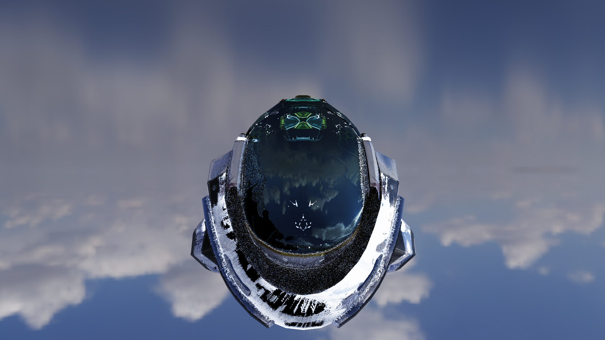
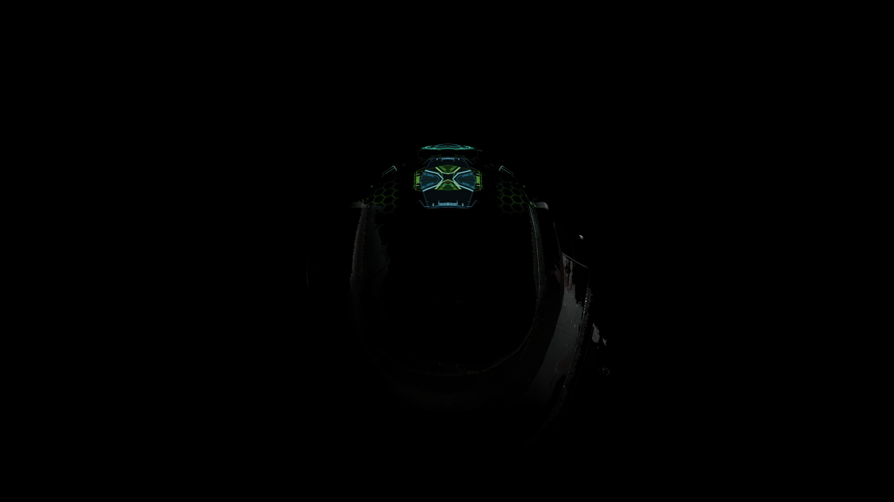
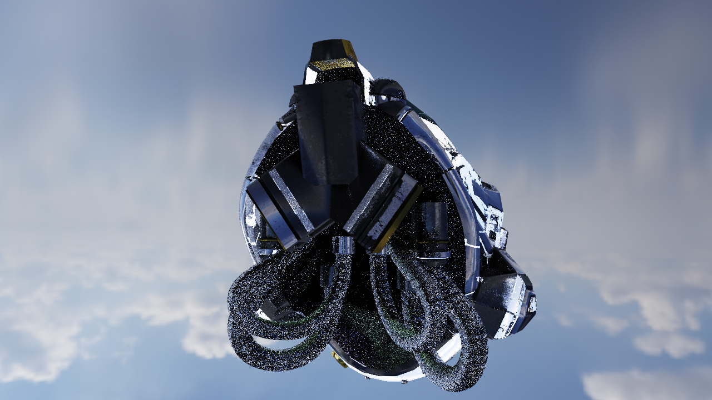

# Building a Vulkan Path Tracer from Scratch

**Date:** April 9-10, 2026
**Engine:** OHAO Engine — Vulkan 1.3 + RTX ray tracing
**GPU:** NVIDIA RTX 5070 Laptop

---

## What We Built

A physically-based path tracer running on Vulkan's hardware ray tracing pipeline. From an empty black screen to real-time interactive rendering in two days.

### The Rendering Pipeline

The path tracer shoots rays from the camera through every pixel. Each ray bounces off surfaces, accumulating color and light. Next Event Estimation (NEE) explicitly samples light sources at every bounce to reduce noise.

**Key features:**
- Cook-Torrance GGX BRDF (physically-based surface shading)
- Bindless textures (sampler2D textures[] — same pattern as Call of Duty)
- Per-pixel normal mapping, roughness, metallic from GLTF PBR materials
- HDR environment map lighting
- Multi-light NEE with sphere, directional, spot, and area rect lights
- ReSTIR DI (Resampled Importance Sampling for direct illumination)
- Temporal accumulation with reprojection
- Spatial denoiser (edge-aware bilateral filter)
- Interactive viewer at 75 fps (1 spp + denoiser)

### Architecture

```
ohao/
  core/           — logging, events, commands
  gpu/vulkan/     — Vulkan device, swapchain, memory, bindless textures
  render/
    rt/           — path tracer, acceleration structures, ReSTIR
    deferred/     — GBuffer, CSM, lighting, post-processing
    camera/       — camera system
  scene/          — actors, components, asset loading (GLTF/OBJ)
  physics/        — Jolt Physics
  audio/          — miniaudio
```

---

## The Journey

### Starting Point: Cornell Box

The classic computer graphics test scene — a box with red and green walls, a light on the ceiling, and two spheres (one metallic, one dielectric). This validates global illumination: light bouncing between colored walls tints nearby surfaces.


*Red wall bleeds onto the metallic sphere. Green wall tints the glossy sphere. Soft shadows from the area light.*

### Loading Real Models: DamagedHelmet

The Khronos DamagedHelmet — the standard PBR test model. Full material pipeline: diffuse textures, normal maps for surface scratches, per-pixel roughness/metallic variation, and emissive HUD elements.


*Battle damage visible from normal maps. Scratched areas are glossier (lower roughness) than intact paint.*

### HDR Environment Lighting

Loading an HDR equirectangular image as the environment. Rays that escape the scene sample the sky instead of returning black. Metallic surfaces reflect the real sky.



*The visor reflects clouds. Armor catches sunlight from all directions. No Cornell box — just the model floating in a real sky.*

### Emissive Mesh Lights

The helmet's HUD elements glow and actually illuminate nearby surfaces. In a dark room, the green emissive X is the only light source.



*Green HUD elements are the sole light source. The emissive texture becomes a real light that casts onto the armor.*

### Real-time Interactive Viewer

GLFW window with Vulkan RT rendering at 75 fps. WASD movement, mouse look. Temporal accumulation blends frames for smooth image. Spatial denoiser removes noise while preserving edges.



*75 fps at 1 spp. Temporal accumulation + bilateral denoiser. Progressive refinement when camera is still.*

### ReSTIR DI: Smart Light Selection

Instead of randomly picking which light to sample, ReSTIR evaluates 8 candidates and keeps the best one proportional to its contribution. Same cost (1 shadow ray), much better results.


*Left: Uniform random — ceiling is flat gray, all 12 lights averaged out. Right: ReSTIR — distinct colored light pools visible on ceiling. Each pixel finds the most important light for its location.*

---

## Technical Highlights

### Bindless Textures
The path tracer uses `sampler2D textures[]` with `nonuniformEXT` indexing — the same modern pattern as the GBuffer shader. Every texture (diffuse, normal, roughness, emissive, environment) lives in one bindless array. Materials store uint texture indices packed as float bits.

### Material Buffer
3 vec4s per material:
```
[0] = (baseColor.rgb, diffuseTexIdx)
[1] = (roughness, metallic, normalTexIdx, emissiveTexIdx)
[2] = (roughMetalTexIdx, unused, unused, unused)
```

### ReSTIR DI
Reservoir-based importance sampling for direct lighting. The same algorithm behind NVIDIA's RTXDI and Cyberpunk 2077's RT Overdrive mode. Sample M=8 candidate lights, evaluate target function (Le × NdotL / dist²), keep one proportionally via reservoir sampling.

### Temporal Reprojection
Store the previous frame's viewProjection matrix. For each pixel, reproject its world-space hit position to the previous frame's screen space. Blend 90% history + 10% new sample. Disocclusion detection rejects invalid history.

---

## Numbers

| Metric | Value |
|--------|-------|
| Interactive FPS | 75 fps at 1 spp |
| Offline render (1080p, 1024 spp) | ~30 sec |
| 4K render (3840×2160, 4096 spp) | ~13 min |
| Shader compilation | <1 sec |
| GLTF model loading | <1 sec |
| Codebase | ~15K lines C++ + GLSL |
| GPU | NVIDIA RTX 5070 Laptop |
| Platform | Linux (Fedora 44) + Windows |

---

## What's Next

- **Multi-pass A-Trous denoiser** — production quality spatial filtering
- **ReSTIR temporal + spatial reuse** — hundreds of effective samples from 1 ray
- **Hybrid RT** — rasterize GBuffer, RT only for shadows/reflections/GI
- **Animation** — skeletal animation with per-frame BLAS rebuild
- **Open source release** — clean API, examples, documentation

---

*Built with OHAO Engine. DamagedHelmet model CC BY 4.0 (Khronos). HDR environments from Poly Haven.*
