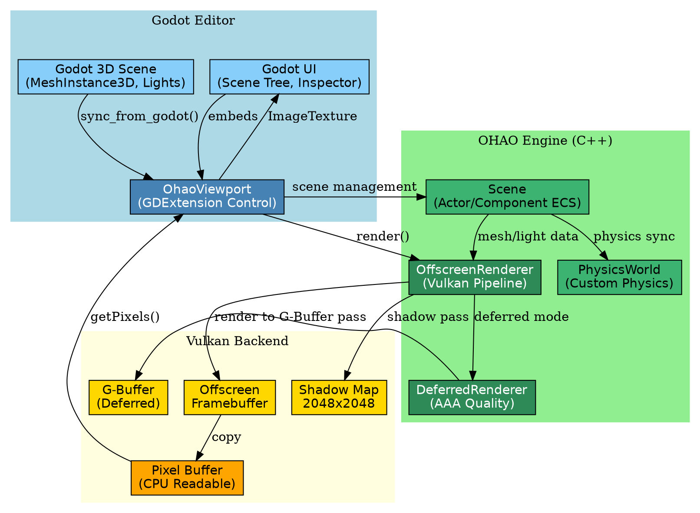
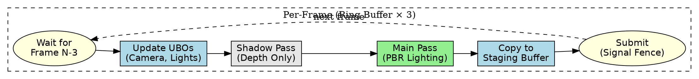
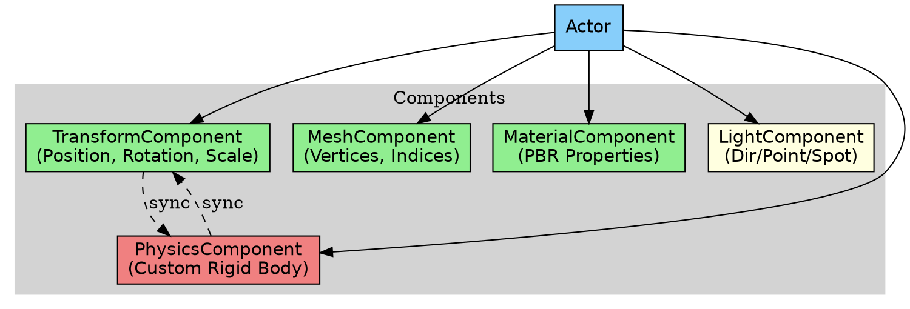

# OHAO Engine Architecture

## Design Philosophy

OHAO Engine is a focused Vulkan renderer and physics simulation engine designed to integrate with Godot as a GDExtension.

### Key Decision: ImGui Removal (18,000+ lines discarded)

In early development, OHAO included a full ImGui-based editor UI. This was **intentionally removed** to:

1. **Focus on core competencies** - Renderer and physics simulation
2. **Leverage Godot's mature editor** - No need to reinvent UI/UX
3. **Reduce maintenance burden** - 18k+ lines of UI code eliminated
4. **Cleaner architecture** - Offscreen rendering enables embedding anywhere

The engine now renders to a pixel buffer, which can be displayed in any host application (Godot, Qt, native window, etc.).

---

## System Architecture



---

## Rendering Pipeline



---

## Component System



---

## Multi-Frame Rendering (Ring Buffer)

```dot
digraph Ring_Buffer {
    rankdir=LR;
    node [shape=record, style=filled, fontname="Helvetica"];

    Frame0 [label="{Frame 0|CMD Buffer|Fence|Camera UBO|Light UBO|Staging Buffer}", fillcolor=lightgreen];
    Frame1 [label="{Frame 1|CMD Buffer|Fence|Camera UBO|Light UBO|Staging Buffer}", fillcolor=lightyellow];
    Frame2 [label="{Frame 2|CMD Buffer|Fence|Camera UBO|Light UBO|Staging Buffer}", fillcolor=lightcoral];

    Frame0 -> Frame1 -> Frame2 -> Frame0 [style=bold];

    GPU [label="GPU Processing", shape=ellipse, fillcolor=lightblue];
    CPU [label="CPU Recording", shape=ellipse, fillcolor=lightblue];

    Frame0 -> GPU [label="executing", style=dashed];
    Frame1 -> GPU [label="queued", style=dashed];
    Frame2 -> CPU [label="recording", style=dashed];
}
```



---

## Directory Structure

```
ohao_engine/
├── src/
│   ├── engine/
│   │   ├── actor/          # Actor base class
│   │   ├── component/      # Component system
│   │   ├── scene/          # Scene management
│   │   └── asset/          # Model/texture loading
│   ├── renderer/
│   │   ├── offscreen/      # Core Vulkan renderer
│   │   ├── frame/          # Multi-frame resources
│   │   ├── passes/         # Render passes (GBuffer, CSM, etc.)
│   │   ├── camera/         # Camera system
│   │   └── components/     # Render components (Mesh, Light, Material)
│   └── physics/            # Bullet physics integration
├── shaders/
│   ├── core/               # Main shaders (forward.vert/frag, gbuffer, deferred_lighting)
│   ├── shadow/             # Shadow mapping shaders
│   ├── postprocess/        # Bloom, TAA, tonemapping
│   ├── compute/            # SSAO, SSR, volumetrics
│   └── includes/           # Shared GLSL (BRDF, lighting, shadow PCF)
├── godot_editor/
│   ├── src/                # GDExtension source (OhaoViewport, OhaoPhysicsBody)
│   └── project/            # Godot project with OHAO plugin
└── docs/
    ├── architecture/       # This document
    └── bugs_solved/        # Bug fix history
```

---

## Rendering Modes

| Mode | Description | Use Case |
|------|-------------|----------|
| **Forward** | Single-pass PBR with 8-light limit | Simple scenes, lower GPU |
| **Deferred** | G-Buffer + light culling, unlimited lights | Complex scenes, AAA quality |

---

## Future Roadmap

1. **GPU-Driven Rendering** - Indirect draw, GPU culling
2. **Mesh Shaders** - When MoltenVK supports them
3. **Ray Tracing** - Hybrid RT for reflections/GI
4. **Asset Pipeline** - glTF 2.0 with material import
